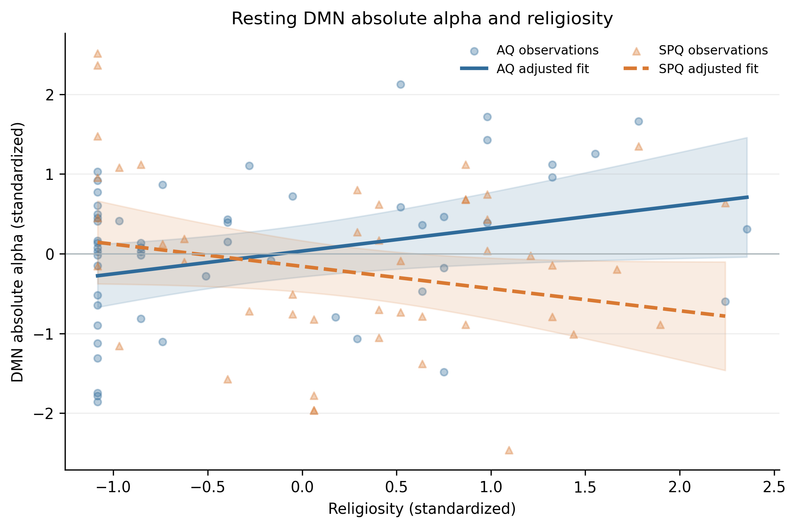
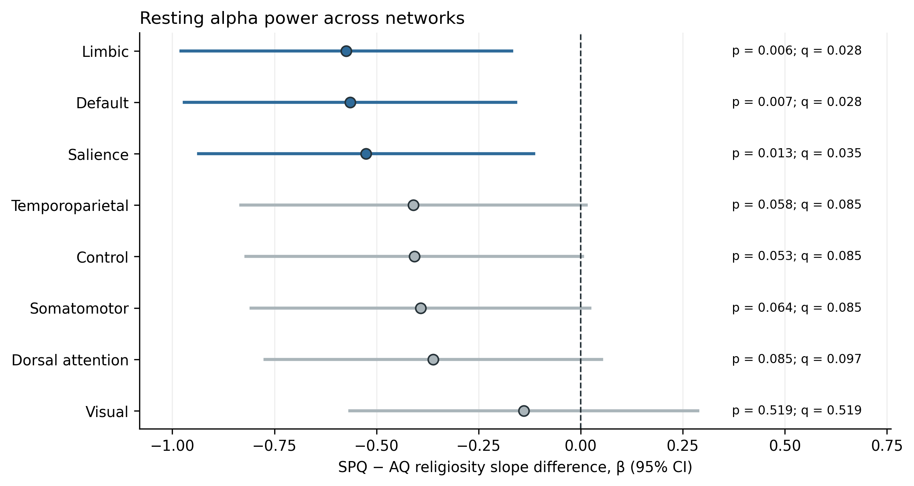
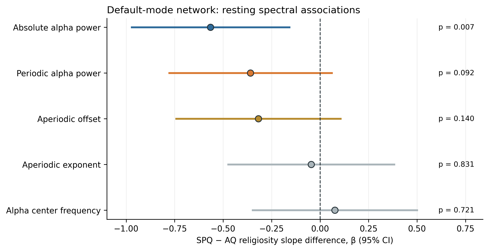
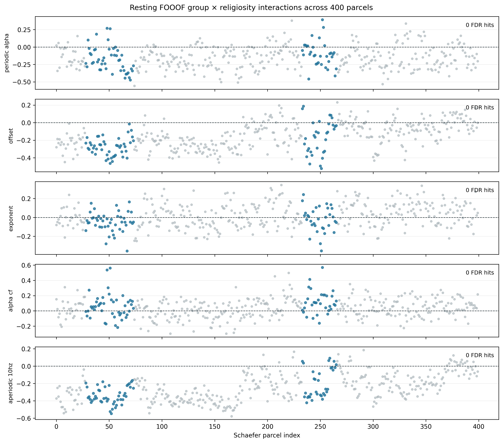

Religious belief draws on general cognitive capacities. Neuroimaging studies [have linked religious judgments to distributed networks]([https://doi.org/10.1073/pnas.0811717106](https://doi.org/10.1073/pnas.0811717106)) involved in theory of mind (ToM), abstract semantics, imagery, emotion, self-representation, and cognitive conflict. [Our prior fMRI study](https://summit.sfu.ca/item/40301) established the functional connectivity in response to religiosity also differ between people with contrasting autistic and schizotypal trait profiles. They pointed out the role of the DMN as an integrative hub for religiosity.

In this follow-up resting-state MEG study, we found partial supporting evidences. Among 100 participants, the relationship between religious faith and a measure of alpha-range brain activity differed between the two groups. But the follow-up analyses complicated the story. The pattern was not confined to the default mode network, and separating alpha rhythms from the broader background signal did not identify a clear explanation.

## The diametric model of autistic and schizotypal Traits

The **diametric model** proposes that some autism-related and psychosis-related characteristics may involve contrasting tendencies in social cognition. One proposed contrast concerns *mentalizing*: interpreting other beings in terms of intentions, beliefs, and feelings. The model suggests that some autistic characteristics involve less spontaneous mental-state attribution, while some psychosis-related characteristics involve attributing intention or personal significance more readily, sometimes beyond what the evidence warrants. This is a theoretical account of selected dimensions, not a description of every person or every feature of either condition. [Crespi and Badcock, 2008](https://doi.org/10.1017/S0140525X08004214).

Religion offers one way to investigate that proposal. Beliefs about intentional supernatural agents could relate to how people attribute minds and agency. But religious life also includes community, ritual, identity, and meaning, which need not have the same relationships with cognitive traits.

Previous evidence illustrates this distinction. A study of autistic and positive schizotypal traits found contrasting associations with spirituality, especially the search for meaning. Yet belief in God was positively associated with positive schizotypal traits and was not associated with autistic traits in that sample. The theory's apparent support therefore depends partly on what researchers measure. [Crespi and colleagues, 2019](https://journals.plos.org/plosone/article?id=10.1371/journal.pone.0213456).
  
Our question concerned whether **brain–religiosity relationships vary by trait profile**. A difference between those relationships would be relevant to the model, but would not by itself establish that the groups have opposite brains or opposite cognitive processes. The theory also does not specify a uniquely justified positive or negative alpha-power slope for these participants.

## Participants

The resting MEG analysis included 100 participants: 54 in the AQ group and 46 in the SPQ group. These were selected, nonclinical trait groups:
- **AQ** refers to the Autism-Spectrum Quotient. The AQ group had relatively high autistic traits and low schizotypal traits.
- **SPQ** refers to the Schizotypal Personality Questionnaire. The SPQ group had the reverse profile: relatively high schizotypal traits and low autistic traits.
  
These labels describe questionnaire-based selection, not diagnoses of autism or schizophrenia. They also do not cover the full range of trait combinations in the general population, including people high or low on both measures.

Religiosity was measured using the [Santa Clara Strength of Religious Faith Questionnaire](https://doi.org/10.3390/rel1010003). “Religiosity” means self-reported strength of religious faith. It is not interchangeable with religious affiliation, spirituality, belief in a particular deity, or the content of someone's thoughts during a scan.

## Resting-state MEG

Magnetoencephalography, or **MEG**, records magnetic fields associated with brain activity. We examined how signal power was distributed across frequencies, focusing first on the alpha range. 
Most importantly, the principal results here concern **resting activity**. We did not measure what happens when someone prays, hears a religious statement, or experiences a religious event. We asked whether resting spectral activity was associated with reported faith differently across the two trait groups.

We selected resting-state for two main reasons: 
- Resting MEG provides a matched context for asking whether the AQ and SPQ trait profiles differ in their religiosity associations with cortical spectral activity. 
- The DMN is associated with spontaneous and internally directed cognition during passive states.

Our absolute-alpha measure took the highest power value between 8 and 12 Hz within each cortical parcel, then averaged those values within a network. It was a peak-in-band measure, rather than the total area under the spectrum across that band.

## Analysis set and model

The resting analysis included 100 participants (AQ: *n* = 54; SPQ: *n* = 46), each with one DMN observation. Each outcome was analyzed using ordinary least squares regression:

$$

Y \sim \mathrm{group} \times \mathrm{religiosity} + \mathrm{sex} + \mathrm{age}.

$$

AQ is the reference group. The interaction coefficient is the SPQ-minus-AQ difference in the religiosity slope.

The participant-level DMN values were calculated from the resting welch spectral power. For absolute alpha, the maximum PSD from 8–12 Hz was taken within each of the parcels and then averaged across 17-networks atlas. FOOOF parameters were fitted per-parcel then parcels with fit $R^2 \geq 0.9$ were averaged across networks.

## Why start with the default mode network?

The default mode network, or DMN, is a distributed set of brain regions associated with internally directed cognition. Research connects it with spontaneous thoughts about experiences, the personal past, and the future. That makes it a plausible candidate for studying individual differences in beliefs and self-related thought, although resting activity does not reveal what someone is thinking. [Andrews-Hanna, 2010](https://pmc.ncbi.nlm.nih.gov/articles/2904225/). A more direct motivation is that our fMRI study reported lower religiosity in the AQ group and group differences in how religiosity related to DMN-linked connectivity. 

The two methods also address different properties. The fMRI studied functional connectivity, whereas this MEG analysis studied spectral power and fitted spectral features. Finding involving the DMN in both would not automatically establish a shared mechanism. We also did not demonstrated a direct participant-level link between the fMRI connectivity findings and the MEG effects described here.

## The clearest finding was a difference in slopes

Within the DMN, higher religiosity was associated with higher absolute alpha power in the AQ group. In the SPQ group, the estimated relationship went in the opposite direction, but that slope was uncertain.
  
The key test compared the two slopes directly. After accounting for age and sex, the **SPQ-minus-AQ slope difference was −0.565**, with a 95% confidence interval from **−0.971 to −0.159** and *p* = .007. The interaction also survived a false discovery rate correction across the eight network tests, with an adjusted value of approximately .028. This correction addresses the increased opportunity for chance findings when several networks are tested.

For readers who want the individual estimates, the standardized AQ slope was **0.286** (95% interval: 0.022 to 0.551), and the SPQ slope was **−0.278** (−0.586 to 0.029). A standardized slope expresses the association in standard-deviation units. The SPQ interval includes zero, so the strongest supported statement is that **the slopes differ**, rather than that each group has a securely established association in an opposite direction.

The interaction remained detectable when using robust standard errors and when leaving out each participant in turn. These checks suggest that it was not dependent on a single participant. They remain checks within the same sample, however. Reconstructing the measure from the original power spectra reproduced the saved result; it did not provide a new replication.

*Figure guide:*  Resting DMN absolute alpha power against religiosity. Lines show OLS predictions at mean standardized age and the reference sex; ribbons show 95% confidence intervals for the mean prediction. Points are reconstructed participant observations.

## The pattern extended beyond the DMN

The DMN was one of three networks whose interactions survived correction. The other two were the limbic and salience networks. All eight network estimates pointed in the same negative direction, meaning the religiosity slope was estimated to be lower in SPQ than AQ.  

Looking at smaller cortical regions, or *parcels*, gave a similarly distributed picture. Interaction estimates were negative in 363 of 400 parcels, including 76 of the 79 DMN parcels. These parcels are correlated measurements within the same participants, not hundreds of independent replications.

Eight parcels survived correction across 400 tests, including two in the DMN. Under a stricter whole-brain permutation correction, only one left temporoparietal parcel survived, outside the DMN. A direct comparison between the DMN and the remaining cortex was inconclusive (*p* = .105).

Together, these results do not establish that the DMN has a uniquely strong effect. They leave open a broader association that includes the DMN, while also failing to prove that every region has the same effect.

*Figure guide:* Group differences in the relationship between religiosity and resting absolute alpha power. Dots show standardized slope differences; horizontal bars show 95% confidence intervals. Zero means equal slopes. Blue marks the three networks surviving correction across eight tests. The adjusted values are approximate because they were calculated from rounded saved p values. These are separate network models, not direct tests of differences between networks.

## What exactly was changing in the alpha range?

A power spectrum can contain a recognizable rhythmic peak sitting above a broad background. An increase in measured power near alpha frequencies can reflect a stronger rhythm, a higher background, or a combination. **Periodic alpha power** describes the fitted peak above that background. **Aperiodic offset** and **exponent** describe the background's level and slope. Spectral parameterization, using FOOOF, estimates these features separately. [Donoghue and colleagues, 2020](https://pmc.ncbi.nlm.nih.gov/articles/PMC8106550/).

When we examined the DMN's fitted components, none showed a clearly supported group difference in its association with religiosity: The periodic-alpha and offset estimates pointed in the same direction as absolute alpha, but were too uncertain to settle the interpretation. A direct test comparing the absolute-alpha and periodic-alpha interactions was also inconclusive (*p* = .231).

Expanding the component analysis to all 400 parcels did not resolve matters. No parcel survived false discovery rate correction for any of the five fitted outcomes, including an exploratory estimate of the background at 10 Hz. Corrected findings also did not emerge in the atlas-subnetwork or exploratory DMN anatomical summaries.

| DMN measure               | SPQ-minus-AQ slope difference | 95% confidence interval | p value |
| ------------------------- | ----------------------------: | ----------------------: | ------: |
| Absolute alpha power      |                        −0.565 |        −0.971 to −0.159 |    .007 |
| Periodic alpha peak power |                        −0.359 |         −0.778 to 0.060 |    .092 |
| Aperiodic offset          |                        −0.318 |         −0.741 to 0.106 |    .140 |
| Aperiodic exponent        |                        −0.046 |         −0.474 to 0.382 |    .831 |
| Alpha center frequency    |                         0.076 |         −0.348 to 0.500 |    .721 |

*Table guide:* All models used 100 participants and adjusted for age and sex. Coefficients describe standardized outcomes; p values in this table are unadjusted. Alpha center frequency describes where the fitted alpha peak occurs.

*Figure guide:* The absolute-alpha finding and the unresolved component results. Overlapping uncertainty matters: one estimate passing a significance threshold while another does not is insufficient evidence that the estimates differ.

## Not enough evidence at parcel level either 

We applied the same group-by-religiosity model to periodic alpha peak power, aperiodic offset, aperiodic exponent, and exploratory alpha center frequency and fitted aperiodic background at 10 Hz. 

The aperiodic background showed 56 out of 400 parcel with interaction effect ( *p*< .05), mostly negative, but none survived correction (minimum *p* = .320). Periodic alpha peak power showed 11 nominal parcel interactions and no corrected discoveries (minimum *q* = .822). A matched-sample absolute-minus-periodic contrast found no parcel-level differences after FDR-correction (minimum _q_ = .549). At the DMN-average level, the direct difference between the absolute-alpha and periodic-alpha interactions was not significant β = −0.206 (*p* = .231). 

This leaves the source of the original association unresolved. The results establish neither an oscillatory-alpha explanation nor an aperiodic-background explanation. Nor do they show that the underlying component associations are absent.

*Figure guide:*  Standardized group-by-religiosity coefficients for five FOOOF outcomes across the 400 resting cortical parcels. Blue points are DMN parcels; gray points are other cortex. No individual FOOOF parcel passed within-outcome FDR correction.

## What does this tell us about the diametric model?
 
The resting default-mode network (DMN) absolute-alpha model showed an AQ–SPQ difference in the association between religiosity and alpha power: The AQ slope was positive, while the estimated SPQ slope was negative but uncertain. Yet, similar evidence in limbic and salience networks prevents a DMN-specific claim.

The spectral parameter analyses did not yield significant group-by-religiosity interactions for periodic alpha power, aperiodic offset, and aperiodic exponent. Periodic-alpha and offset estimates pointed in the same direction as the absolute-alpha estimate, but their intervals crossed zero line. The results thus do not establish which spectral component contributes to the absolute-alpha association. 

The study supports the association between religious faith and resting absolute alpha power differed between the selected AQ and SPQ groups. That is the most significant evidence that trait profiles can shape brain–religiosity relationships.

However, it does not establish the stronger account that alpha-oscillatory activity responses to the observation. The SPQ slope remains uncertain, the effect is not limited to DMN-specific region, and its periodic or aperiodic basis remains unresolved. 

